# MyLearning

An LLM-enhanced learning assistant Android app built for SIT305 Mobile Application Development (Task 10.1) at Deakin University.

MyLearning generates AI-powered quizzes, explanations, and lesson summaries using the Gemini API, with a tiered monetisation system, quiz history tracking, video suggestions, and a shareable user profile.

## Features

**Core Learning Flow**
- AI-generated multiple-choice quizzes across 35+ academic topics
- Per-question AI explanations powered by Gemini
- Short topic lessons — AI summaries or personalised reviews based on starred questions
- Gemini-validated custom topic creation (rejects vague terms, categorises automatically)

**Monetisation & Tiers**
- Three tiers: Free, Starter, Advanced — each unlocking progressively more features
- Simulated billing flow via styled bottom sheet (production-ready BillingManager interface for Google Play swap)
- Tier-gated quiz limits, question counts, AI explanations, video suggestions, and history access
- Frictionless upgrade prompts with tappable links throughout the app

**History & Progress**
- Full quiz history with lazy-loaded question detail on expand
- Per-topic detail screen with accuracy stats, attempt history, and quick actions
- Learning Progress tab with colour-coded score cards and focus badge for weak topics
- Stats refresh on every screen return — always current data

**Profile & Sharing**
- Profile screen with 10 stat cards: total questions, correct/incorrect, average score, active topics, total quizzes, best/worst topic, days since last quiz
- Tappable avatar with image picker — center-cropped, compressed, stored as Room blob
- AI-powered learning insight (Advanced tier) — personalised coaching summary from Gemini
- Plain text share via Android share sheet
- All stat cards link to their relevant screens

**Video Suggestions**
- Gemini-distilled YouTube search queries (3–5 focused words instead of raw question text)
- Fires as a browser intent — no embedding, no external API, always current results
- Gated per tier with per-session counters


## Screenshots

<table>
  <tr>
    <td align="center"><b>Login</b><br>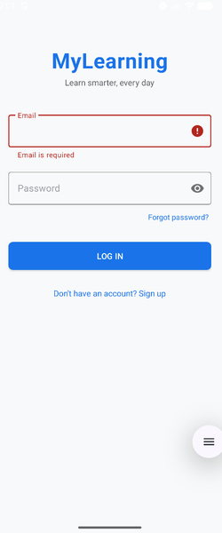</td>
    <td align="center"><b>Sign Up</b><br>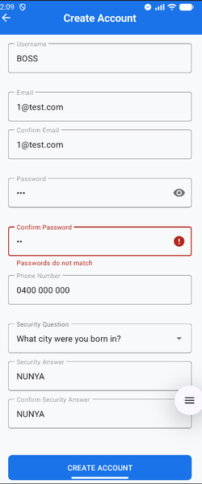</td>
    <td align="center"><b>Forgot Password</b><br>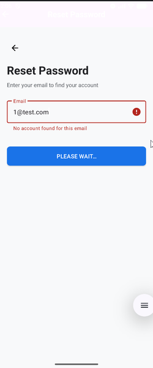</td>
  </tr>
  <tr>
    <td align="center"><b>Choose Interests</b><br>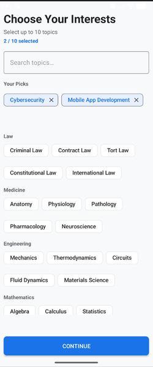</td>
    <td align="center"><b>Home</b><br>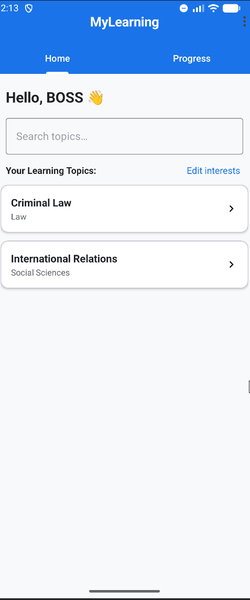</td>
    <td align="center"><b>Progress</b><br>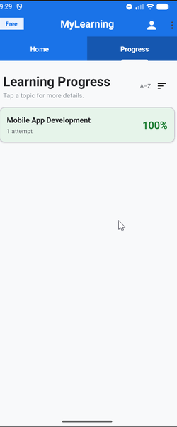
  </tr>
  <tr>
    <td align="center"><b>Lesson</b><br>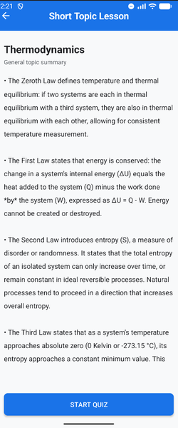</td>
    <td align="center"><b>Quiz</b><br>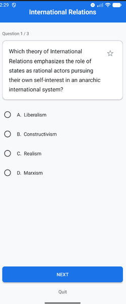</td>
    <td align="center"><b>Results</b><br>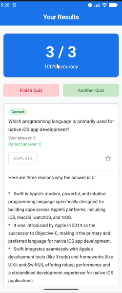</td>
  </tr>
  <tr>
    </td>
    <td align="center"><b>Targeted Lesson</b><br>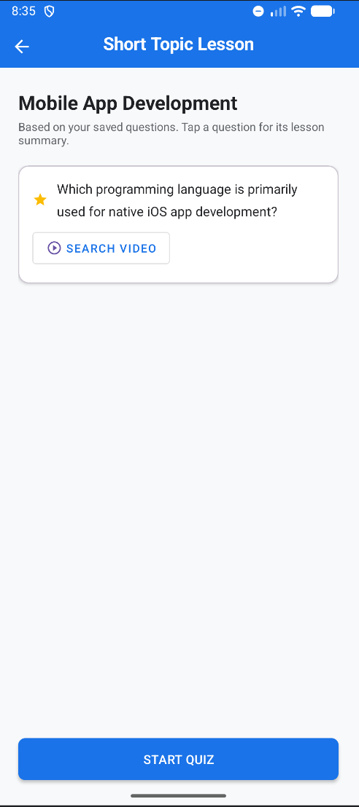</td>
    <td align="center"><b>(New) Topic Detail</b><br>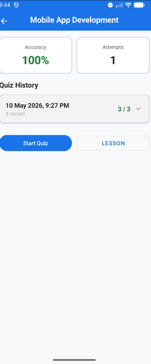</td>
    <td align="center"><b>(New) Topic Detail (Expanded)</b><br>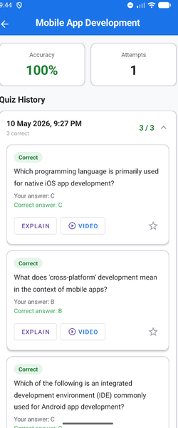</td>
  </tr>
  <tr>
    <td align="center"><b>(New) Profile</b><br>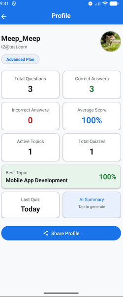</td>
    <td align="center"><b>Customised AI Learning Insight</b><br>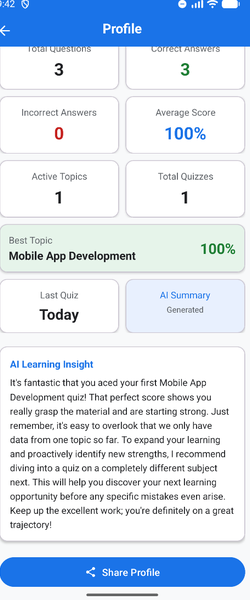</td>
    <td align="center"><b>(New) Upgrade</b><br>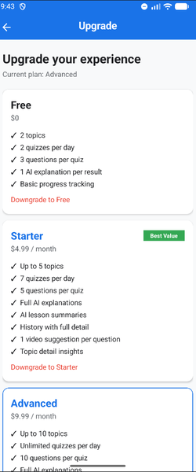</td>
  </tr>
  <tr>
    <td align="center"><b>(New) Share Profile</b><br>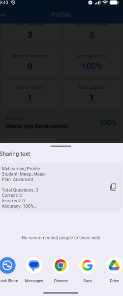</td>
    <td align="center"><b>(New) Specific Question Video Suggestions</b><br>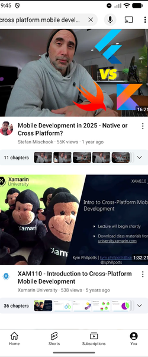</td>
    <td align="center"><b>Splash Screen</b><br></td>
    <td></td>
  </tr>
</table>


## Tech Stack

- **Language:** Java
- **Build:** Gradle KTS, AGP, compileSdk 36, minSdk 26
- **Database:** Room (v4 schema, UUID fields on all entities, destructive fallback + targeted migrations)
- **Network:** Retrofit + OkHttp, Gemini API (`gemini-2.5-flash`)
- **UI:** Material Design 3, ViewBinding, manual LinearLayout inflation (no RecyclerView)
- **Auth:** Hashed passwords with per-user salt, secure session management
- **Billing:** SimulatedBillingManager with identical interface to Google Play BillingClient for production swap
- **Architecture:** Activity-based with Fragments for tabbed home, AsyncTask for background operations, single Room singleton

## Project Structure

The app follows a standard Android package structure under `com.example.mylearning`, with sub-packages for `billing`, `data` (Room entities, DAOs, and database), `network` (Retrofit/Gemini client), `ui` (Fragments), and `util` (session, tier, hashing, and toolbar helpers). Activities cover the full user flow from auth through quizzes, results, lessons, history, profile, and upgrade.

## Design Decisions

| Decision | Rationale |
|---|---|
| Room over cloud backend | Offline-first reliability; entities structured with UUIDs and timestamps for future Firebase sync without refactoring |
| Simulated billing over Play Billing | Google Play Billing requires a paid developer account ($25 USD) outside assignment scope; BillingManager interface is production-ready for swap |
| Plain text sharing over QR codes | Maximum platform compatibility, zero third-party dependencies, spec-compliant |
| Gemini-distilled video queries | Raw question text produces poor YouTube results; a lightweight Gemini call generates focused 3–5 word queries with static fallback on failure |
| No RecyclerView | Original codebase uses manual LinearLayout inflation throughout; consistency maintained across all screens with lazy-loading to mitigate scroll performance |
| AsyncTask over ExecutorService | Matches existing codebase pattern; switching mid-project risks introducing bugs in working screens |
| Destructive migration (v2→v3) + proper migration (v3→v4) | UUID fields required schema rebuild; profileImage column added non-destructively to preserve user data |


## Setup

1. Clone the repository
2. Open in Android Studio (Ladybug or later)
3. Add your Gemini API key to `local.properties`:
   ```
   GEMINI_API_KEY=your_key_here
   ```
4. Sync Gradle and run on an emulator or device (API 26+)

## AI Declaration

This project was developed with the assistance of Claude (Anthropic) as a code generation and architectural planning tool. All AI-generated code was reviewed, tested, and modified by the student.

## Legal

This project was created for educational purposes as part of Deakin University's SIT305 unit. All rights reserved. Reuse, redistribution, or reproduction of any part of this codebase requires explicit written permission from the author.
